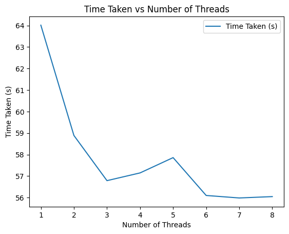
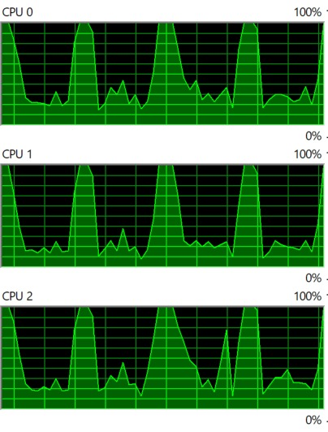
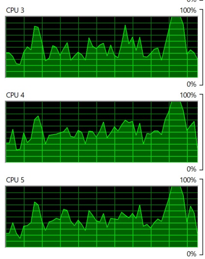
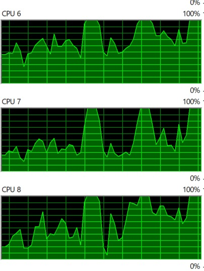
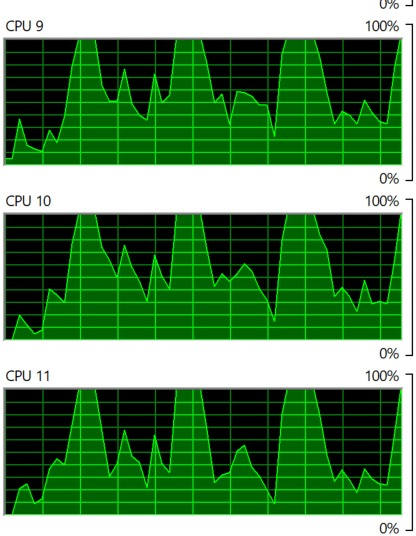

# MultiThreading
## Submitted by:
- Name - Eakansh Agarwal
- Roll number - 102103280
- Group - 3COE10

## Objective
The objective of this code is to demonstrate multi-threaded matrix multiplication in Python using numpy and threading libraries. The goal is to compare the performance of matrix multiplication using different numbers of threads.

## Methodology
- ### Generate Matrices
The generate_matrices function generates a list of random matrices based on the specified number of matrices (num_matrices) and the size of each matrix (size).

- ### Matrix Multiplication
The matrix_multiply function performs matrix multiplication using a constant matrix and a list of input matrices. It uses numpy's dot function for matrix multiplication.

- ### Multi-threaded Matrix Multiplication
The matrix_multiplication_using_threads function performs matrix multiplication using multiple threads. It divides the list of matrices into chunks based on the number of threads and assigns each chunk to a separate thread for parallel processing.

- ### Performance Measurement
The code measures the time taken for matrix multiplication using different numbers of threads (num_threads) and records the results in a dictionary.

- ### Results Display
The code prints the time taken by each number of threads for matrix multiplication and stores the results in a dictionary (results).
Usage

- #### Threads vs Time Taken

| Threads | Time (sec) |
| ------- | ---------- |
| 1       | 64.017897  |
| 2       | 58.888875  |
| 3       | 56.788485  |
| 4       | 57.147921  |
| 5       | 57.859248  |
| 6       | 56.099488  |
| 7       | 55.983568  |
| 8       | 56.046847  |

- #### Output Graph

- #### CPU core utilization

## Conclusion
The results demonstrate that multi-threading can significantly reduce the time taken for matrix multiplication, especially as the number of threads increases. However, there may be diminishing returns beyond a certain number of threads due to overhead and resource limitations.
